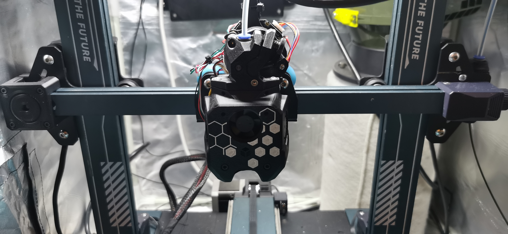
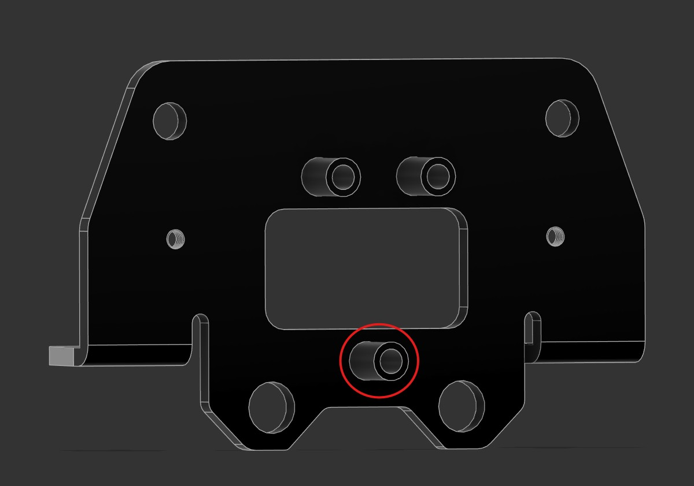

# A4T Adapter for Elegoo Neptune 4  
A toolhead adapter by **Beattune**

> [!NOTE]  
> This adapter supports the **Elegoo Neptune 4** with the original **POM-wheel carriage**.  
> The **Elegoo Neptune 4 Pro** is currently untested and therefore not officially supported.

  

## Overview

The Elegoo Neptune 4 is a fast and reliable 3D printer, but the available hotends for the stock or custom tool heads are limited.  
The original POM-wheel carriage does not support many well-known high-flow tool heads, which is why this adapter was created.  

This adapter allows you to mount a wide range of popular tool heads using the **Voron CW2 mount pattern**.  
It is optimized for use with the **[A]nother [4]010 [T]oolhead**, offering excellent hotend support and highly efficient airflow due to CFD-optimized 4010 fan ducts.

There is **no loss in X or Y build volume**, and — depending on cable routing — **no loss in Z height** either.

- More information about **A4T**:  
  https://github.com/Armchair-Heavy-Industries/A4T

You can configure your ideal setup using the **A4T Web Configurator**:  
https://a4t.wizards-enclave.net/  
When using the configurator, make sure to select **Voron Tap** as the carriage option.  
All other settings are up to you.  
If you plan to add **Neopixel LEDs** to your A4T, note that the stock tool head breakout board cannot be used.

### Recommended Setup (Used and Verified by Me)

- **Extruder:**  
  [Wristwatch BMG for A4T](https://github.com/Armchair-Heavy-Industries/A4T/tree/main/STL/WW-BMG%20for%20A4T)
- **Extruder Stepper:**  
  [Moons CSE14HRA1L410A-02](https://de.aliexpress.com/item/1005005870658160.html)  
  (The original extruder stepper can be reused but is weaker than a Moons 8-tooth stepper.)
- **Hotend:**  
  [Triangle Labs Dragon Ace Volcano](https://trianglelab.net/products/dragon-ace%E2%84%A2-hotend?VariantsId=12006)  
  Use **104NT-4** with the original breakout board, otherwise choose **PT1000**.
- **PCB Mount:**  
  [LDO NightHawk36](https://de.aliexpress.com/item/1005007544684952.html)  
  (If preferred, the stock Elegoo breakout board can also be reused — a compatible mount is available [here](https://github.com/Open-Elegoo-Community/Neptune4_A4T_accessories).)
- **Part Cooling Fans:**  
  [GDStime 12,000 RPM (24 V)](https://www.aliexpress.com/item/1005005094153190.html)
- **Hotend Fan:**  
  [HoneyBadger Performance 2510 Axial (24 V)](https://www.fabreeko.com/collections/axial-fan/products/2510-performance-axial-fan-by-honeybadger)

---

## Bill of Materials (BOM)

| QTY | Item | Notes |
| --- | ---- | ----- |
| 6 | M3 threaded heat-set insert (Ø4.5 mm OD, 4 mm length) | BTT Eddy version requires only 5 |
| 2 | M3×8 mm SHCS | Mounting adapter to the POM-wheel carriage |
| 1 | M4×12 mm BHCS | Additional bottom mounting screw |
| 1 | M4 tap wrench | Required for cutting the M4 thread in the POM carriage |

---

## Printing the Parts

The parts were designed for a **0.2 mm layer height**.  
A first layer of **0.25 mm** works well. Other layer heights have not been tested and may lead to unexpected tolerance issues.

Print settings depend on your machine and filament. The model is **not pre-scaled** for shrinkage compensation — you may need to tune your filament for a precise fit.  
Development and testing were done using **Elegoo ASA** and **Fiberlogy ASA** (each individually tuned).

### Verified Print Settings

- Layer height: **0.2 mm**
- Line width: **0.4 mm**
- Wall loops: **6**
- Top layers: **10**
- Bottom layers: **10**
- Infill density: **40%**
- Infill pattern: **Honeycomb or Triangle**

Since this part is a structural adapter for your tool head, prioritize **strength** and **layer adhesion**.

---

## Assembly Guide

### 1. Remove the Original Tool Head
- Disconnect the tool head cable.  
- Remove the rear screws securing the tool head to the carriage.  
- Remove the front screws.  
- Lift off the original tool head.

### 2. Remove the POM-Wheel Carriage
> [!NOTE]  
> If you are using a **Neptune 4 Pro**, you may skip this step and Step 3.

- Disassemble the top two POM wheels.  
- Remove the X-axis belt from the carriage.  
- Remove the POM-wheel carriage.

### 3. Add the M4 Thread to the POM-Wheel Carriage
- Cut an M4 thread into the **bottom center standoff**.  
- Thoroughly clean the POM-wheel carriage afterwards.  

### 4. Reassemble the POM-Wheel Carriage
- Mount the carriage back onto the X-extrusion and reinstall the top POM wheels.  
- Verify proper wheel alignment: motion should be smooth with **no detectable wobble**.  
- Reattach the X-axis belt.

### 5. Assemble the A4T Adapter
- Install the M3 heat-set inserts (see picture).  
- Place the adapter onto the POM carriage; it will align over the two metal standoffs.  
- Insert **two M3×8 mm screws** (left + right) and thread them loosely.  
- Insert **one M4×12 mm screw** into the bottom hole and thread it loosely.  
- Tighten all screws in this order:  
  **1. M4 bottom → 2. Left M3 → 3. Right M3**

### 6. Assemble the A4T Tool Head
Follow the official assembly instructions:  
https://github.com/Armchair-Heavy-Industries/A4T?tab=readme-ov-file#assembly

---

## Credits

Thanks to everyone who contributed ideas, feedback, or testing to make this adapter possible!

---

## Enjoy Your A4T!

Have fun using your A4T tool head with the Elegoo Neptune 4! If you have improvements or suggestions, feel free to open an issue or contribute to the project.

[def]: /images/POM-wheel-carriage.jpg